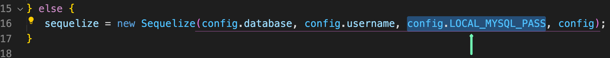
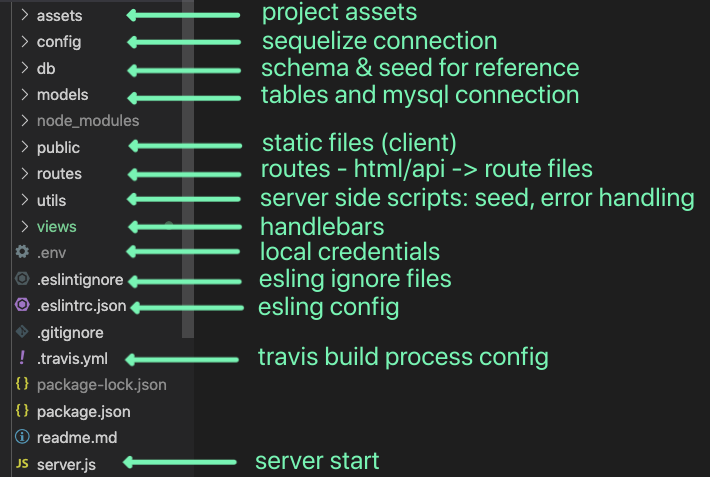

# group1-project2

 
# 📦 Express Sequelize box

## To-Do: Readme!

## Use
- Fork or clone and copy what you need

## env vars
- for production set on heroku: https://dashboard.heroku.com/apps/<app-name>/settings -> reveal env vars
- locally: creat a `.env` file with key and value pair in form/url encoding `SECRET_KEY=val`
- connection code on models/index.js: 

## Folder structure

## CI
- travis: travis.io
- code coverage: codacy.com
- monitor on: https://ronerlih.loggly.com/search?terms=tag:heroku&from=-20m&until=now&source_group=&newtab=1#terms=&from=2020-11-07T12:03:00.296Z&until=2020-11-07T13:03:00.296Z&source_group=

## To-Do:
- write tests (Jest / mocha+chai)
   - send test reports to code covarage 

- log (winston/ bunyan/ log4js/ morgan)
   - dashborad monitor + notifications

## Further
- express best practices: https://expressjs.com/en/advanced/best-practice-performance.html

# Project 2

## Application Requirements

* Must use a Node and Express server

* Must use Handlebars.js as the template engine

* Must be backed by a MySQL database with a Sequelize ORM

* Must utilize both GET and POST routes for retrieving and adding new data

* Must be deployed using Heroku (with data)

* Must utilize at least one new library, package, or technology that we haven’t discussed

* Must have a polished front end/UI

* Must have a folder structure that meets the MVC paradigm

* Must meet good quality coding standards (indentation, scoping, naming)

* Must protect API keys in Node with environment variables

## Presentation Requirements

Use this [project presentation template](https://docs.google.com/presentation/d/1_u8TKy5zW5UlrVQVnyDEZ0unGI2tjQPDEpA0FNuBKAw/edit?usp=sharing) to address the following: 

* Elevator pitch: a one minute description of your application

* Concept: What is your user story? What was your motivation for development?

* Process: What were the technologies used? How were tasks and roles broken down and assigned? What challenges did you encounter? What were your successes?

* Demo: Show your stuff!

* Directions for Future Development

* Links to to the deployed application and the GitHub repository. Use this guide for [deploying your application to Heroku](../04-Important/GitHubHerokuConnect.md) if you need a reminder on how to deploy!

## Grading Metrics 

| Metric        | Weight | 
| ---           | ---    |
| Concept       | 10%    |
| Design        | 20%    |
| Functionality | 30%    |
| Collaboration | 30%    |
| Presentation  | 10%    |

## Submission on BCS

You are required to submit the following:

* The URL of the deployed application

* The URL of the GitHub repository