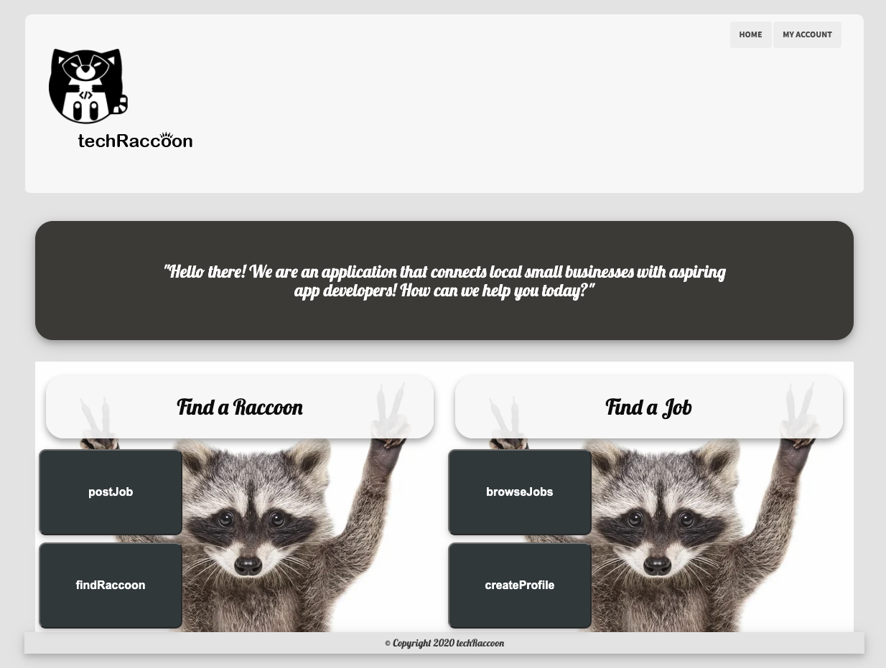
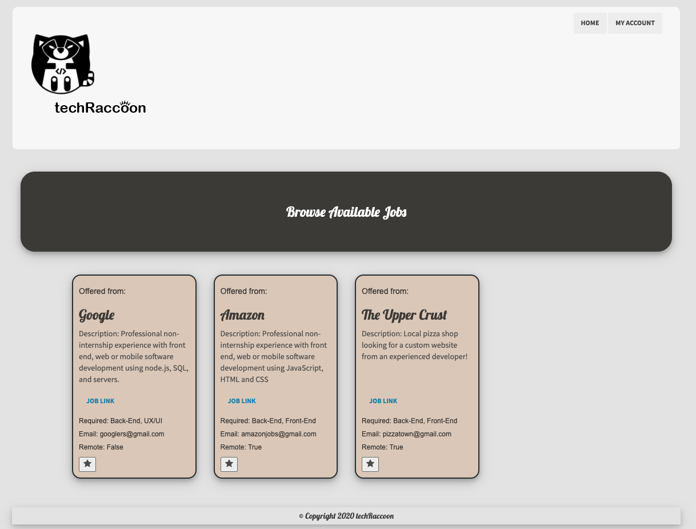
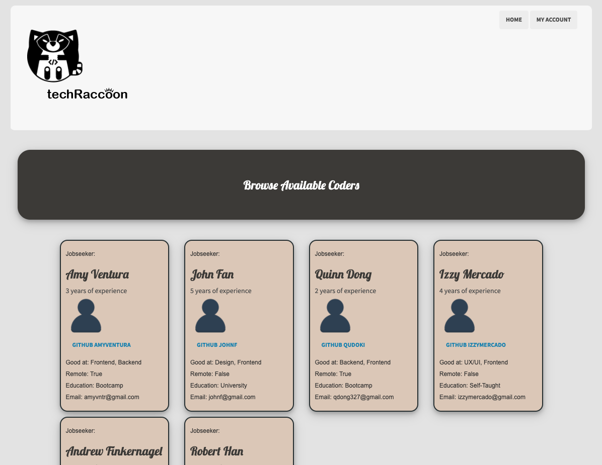
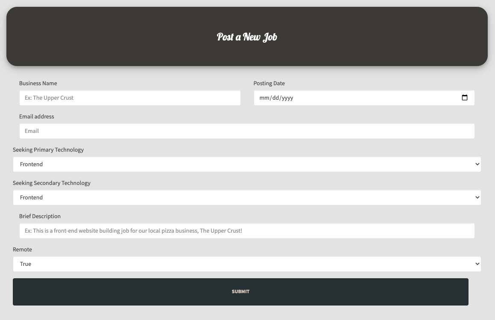
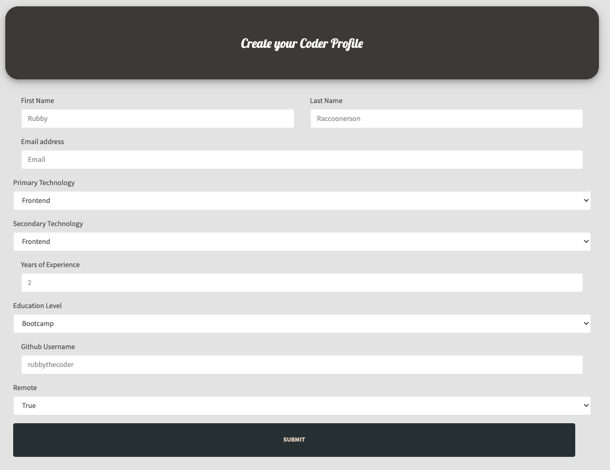
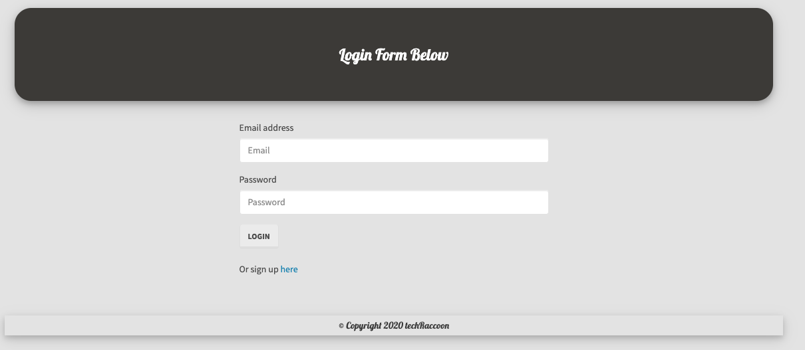
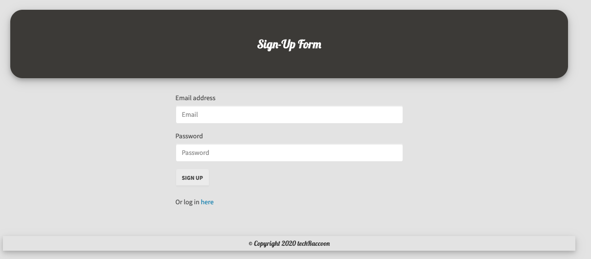

# TechRaccoon 

### Description: 
Hello all, and welcome to our site dedicated to assisting both job seekers and small businesses who are seeking new candidates for their existing or up and coming business.

Our application which has been dubbed "TechRaccoon" is geared towards folks and businesses that are looking to hire within the tech industry, whether that is in software engineering or within programming universe. This application is catered to those that are looking to expand their horizons with their existing skills, or learn some new skills from a new job environment!

This application takes advantage of several different types of data that are gathered from SQL servers, backend javascript, handlebars to operate the front end, and of course API routes! Other technologies or packages utilized include express, express handlebars, node.js, passport, and becrypt.

The application is meant to gather certain skills from applicants that want to list their knowledge base. Using things like education and coding launguages, to employnent history just to name a few. Our application is also designed to filter out applicants with certain requirements they prefer. Such as a degree or certification.

Our app is geared for those who would like to create a login and track their application history and edit some profile options, creating a more personalized experience for both the user and the employer. 

We wanted our application to be as user friendly and intuitive as possible without becoming overbearing, and the result is something fairly simple that results in catering to nearly all audiences. The small businesses that are looking to hire new candidates for their team or the folks that are straight out of college!

# Table of Contents
- [Installation](https://github.com/qudoki/group1-project2/blob/main/README.md#installation)
- [Usage](https://github.com/qudoki/group1-project2/blob/main/README.md#usage)
- [Screenshots](https://github.com/qudoki/group1-project2/blob/main/README.md#screenshots)
- [Tests](https://github.com/qudoki/group1-project2/blob/main/README.md#usage)
- [Contributing](https://github.com/qudoki/group1-project2/blob/main/README.md#contributions)
- [Questions](https://github.com/qudoki/group1-project2/blob/main/README.md#questions)
- [License](https://github.com/qudoki/group1-project2/blob/main/README.md#license)

## Installation:
- This package requires node.js and Inquirer. You can install the package dependencies by entering the following command: ""npm i" if running locally, otherwise it is deployed on Heroku."

## Usage:
- In order to use or test this package, please enter the following command: "See Travis or ESLint documentation." and follow the prompts.

## Screenshots:

#### Home Page

#### Browse Jobs

#### Find Raccoons (Coders)

#### Create Job

#### Create Profile

#### Login

#### Signup

## Contributing:
- In most cases, please refer to this document: [Contributor Covenant](https://www.contributor-covenant.org/) 

- Please notify the repository holder if you'd like to contribute.
- Please notify the collaborators as well.

## Questions:
If you have any questions, please feel free to reach us via Github or email below.

- qudoki [Github Profile](https://github.com/qudoki)
- amyventura [Github Profile](https://github.com/amyventura)
- johnfan7 [Github Profile](https://github.com/johnfan7)
- ismaelm1991 [Github Profile](https://github.com/ismaelm1991)

### Contributors:
- <qdong327@gmail.com>
- <amyvntr@yahoo.com>
- <phantastic1999@gmail.com>
- <ismaelgmercado@yahoo.com>

 
## License:

    Copyright 2020 Tech Raccoon (Group 1 - Project 2)

    Permission is hereby granted, free of charge, to any person obtaining a copy of this software and associated documentation files (the "Software"), to deal in the Software without restriction, including without limitation the rights to use, copy, modify, merge, publish, distribute, sublicense, and/or sell copies of the Software, and to permit persons to whom the Software is furnished to do so, subject to the following conditions:
    The above copyright notice and this permission notice shall be included in all copies or substantial portions of the Software.
    THE SOFTWARE IS PROVIDED "AS IS", WITHOUT WARRANTY OF ANY KIND, EXPRESS OR IMPLIED, INCLUDING BUT NOT LIMITED TO THE WARRANTIES OF MERCHANTABILITY, FITNESS FOR A PARTICULAR PURPOSE AND NONINFRINGEMENT. IN NO EVENT SHALL THE AUTHORS OR COPYRIGHT HOLDERS BE LIABLE FOR ANY CLAIM, DAMAGES OR OTHER LIABILITY, WHETHER IN AN ACTION OF CONTRACT, TORT OR OTHERWISE, ARISING FROM, OUT OF OR IN CONNECTION WITH THE SOFTWARE OR THE USE OR OTHER DEALINGS IN THE SOFTWARE.